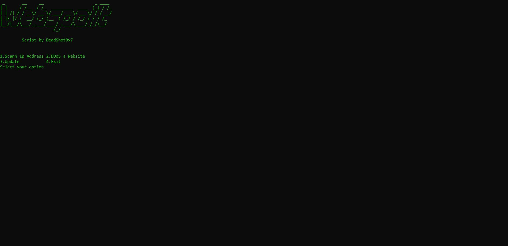

# **Webspoilt - Website Information and Penetration Testing Script** 🌐🛡️

Webspoilt is a powerful script designed to help you gather information about websites and conduct penetration testing. However, it comes with a **disclaimer** that the creator will not be responsible for any misuse of the script, and users are liable for any losses resulting from their actions.

## **Features** 🚀

1. **Find IP Address of the website**
2. **DDoS Attack on the website**
3. **Bruteforce for various platforms** such as Instagram, Spotify, Twitter, Netflix, Amazon Prime Video, and Pinterest.
4. **Port Scanner** (Coming soon)

## **Download and Installation** 💾

**Linux**:
1. Clone the repository using the git clone command.
2. Navigate to the Webspoilt directory.
3. Install the required dependencies using either `pip install -r Requirements.txt` or run `setup.sh`.
4. Run the script with `python3 Webspoilt`.

**Macintosh**:
1. Clone the repository using the git clone command.
2. Navigate to the Webspoilt directory.
3. Install the required dependencies using either `pip install -r Requirements.txt` or run `setup.sh`.
4. Run the script with `python3 Webspoilt`.

**Termux**:
1. Clone the repository using the git clone command.
2. Navigate to the Webspoilt directory.
3. Install the required dependencies using either `pip install -r Requirements.txt` or run `setup.sh`.
4. Run the script with `python3 Webspoilt`. (Note: The Instagram user finder may not currently work in Termux.)

## **Testing** 🧪

Webspoilt has been tested on the following operating systems:
1. Kali Linux
2. Parrot Linux
3. Termux (Please note that the Instagram user finder is not currently working in Termux)
4. Garuda Linux

For more information and updates, visit the [Webspoilt blog](https://jarvisstaraq.blogspot.com/).

Remember to use this script responsibly and ethically. Happy testing and exploring websites! 🕵️‍♂️🔍